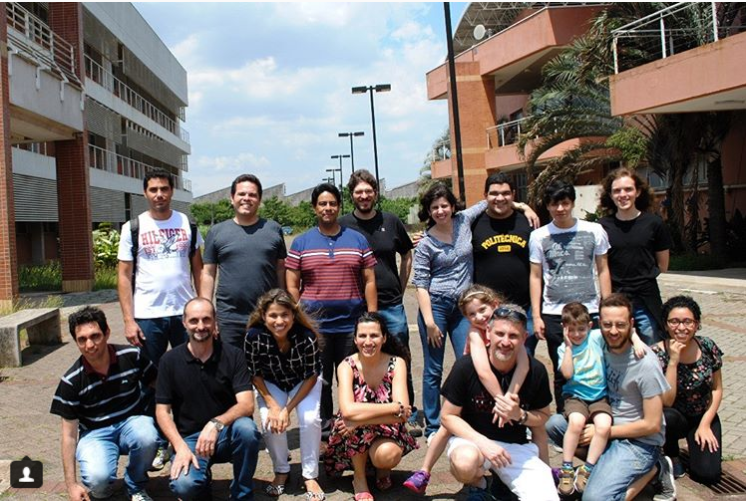

# _LApIS for fun_

## Cadastro biometria

Pedir para o orientador enviar nome número USP (ou RG) para:

 - Ernani Barone
   - barone60@usp.br
   - Ramal 918192
   - Final do corredor no térreo do A2 

## IMPORTANTE!!! O Café

Passada por gerações de pós-graduandos essa é a receita [nem tão] secreta do café, defenda-a com sua vida!

* Usar uma medida de café para cada três unidades (xícaras) da cafeteira!

Favor manter a mesa limpa e ao fim do dia não esquecer de limpar a cafeteira de retirar o lixo.

## Fechando 2017 - #teamLApIS

.

